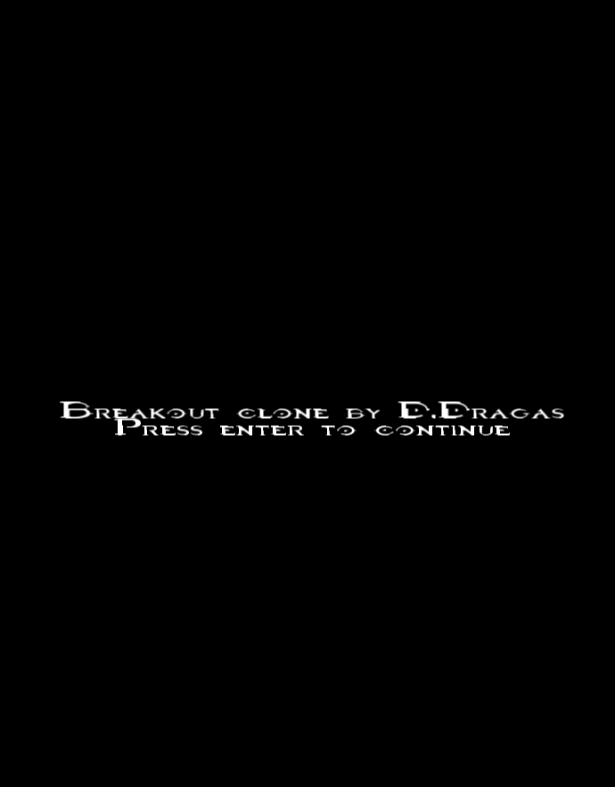
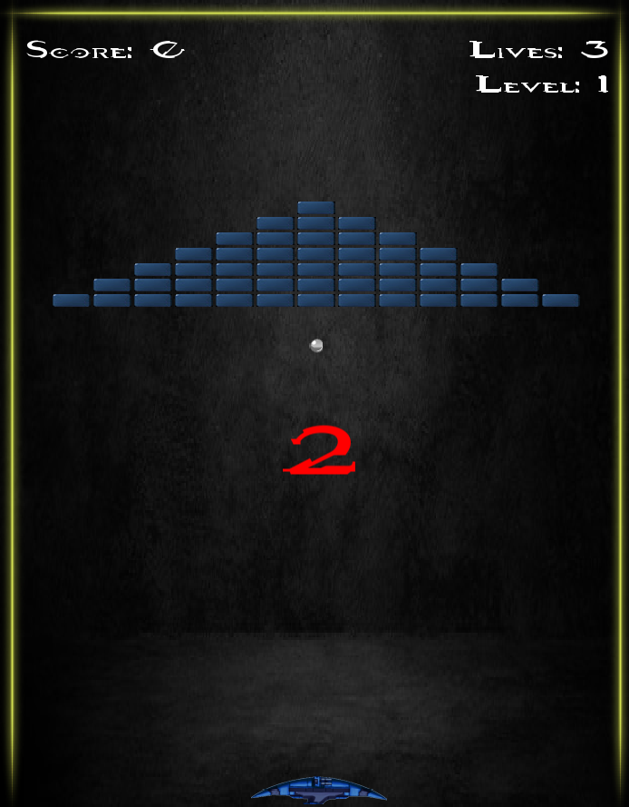
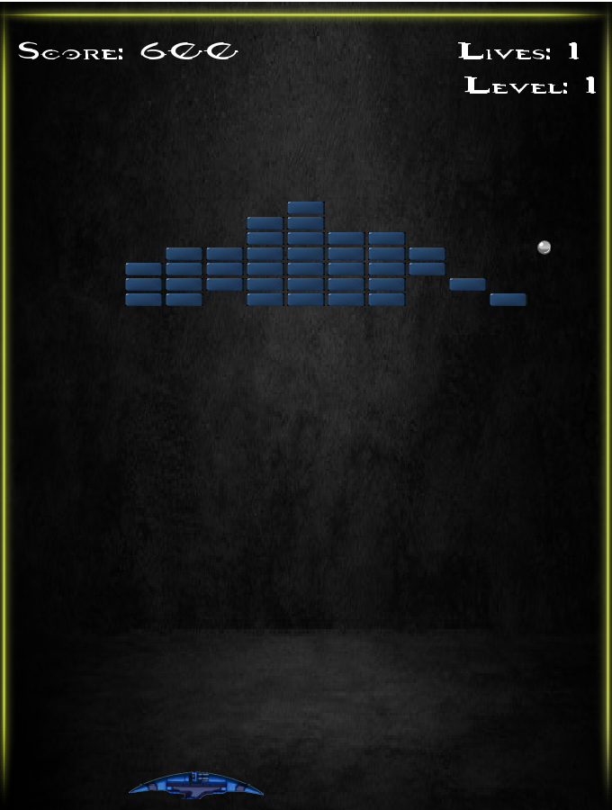

# Breakout

Jednostavna kopija stare igre Atari Breakout

Nakon što se pritisne ENTER počinje igra.
Igrač dobiva ekran igre:

Počinje otkucavati timer od 3 sekunde, potom pada loptica i igra počinje. Igrač kontrolira brod sa mišem
koji se može kretati u dva smjera: lijevo ili desno. Zadatak igre je kontinuirano pogoditi lopticu brodom
tako da loptica ne padne ispod ekrana, a ujedno i pogoditi sve cigle kako bi igrač došao do iduće razine.

Level 1:

Level 2:

Level 3:

Kada igra završi ispisuje se završni rezultat.

